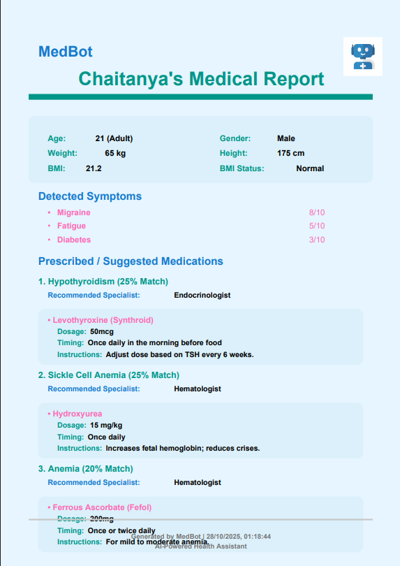

# 🩺 MedBot – AI Medical Chatbot Assistant

> **MedBot** is a dual-mode AI medical assistant that identifies possible diseases based on user-entered symptoms, severity levels, and personal data.  
> It provides interactive health conversations, personalized prescriptions, specialist recommendations, and generates structured medical reports — powered by NLP, fuzzy logic, and OpenAI.

---

## 🧠 Demo & Preview

<video src="attached_assets/generated_images/demovideo.mp4" controls width="600"></video>


### 📄 Sample Generated Report  



---

## 🌟 Overview

MedBot is designed to **bridge the gap between self-diagnosis and early medical awareness**.  
It intelligently processes user symptoms — even with **spelling errors or incomplete inputs** — and maps them to probable diseases with corresponding treatment guidance.

---

## 🚀 Key Features

- 💬 **Conversational UI** – Natural, chat-style medical interaction  
- 🧠 **Two Intelligent Modes**  
  - 🔹 **Normal Mode (Offline NLP)** → Uses Fuse.js + NLTK for fuzzy disease mapping  
  - 🔹 **API Mode (Online AI)** → Uses OpenAI API for advanced medical reasoning  
- 🔍 **Symptom Recognition** with fuzzy text matching  
- 📊 **Severity Level Slider (0–10)**  
- 🧬 **Disease Probability Estimation**  
- 💊 **Age-Based Medicine Suggestions** (child, adult, elderly)  
- 🧑‍⚕️ **Specialist Recommendations**  
- 📄 **Organized Medical Report Generation (Downloadable PDF)**  
- 🧩 **Auto-Fallback System** – Switches to demo/local mode when API fails  
- 💡 **Clean, responsive UI** built with React + Tailwind  

---

## 🏗️ Tech Stack

| Layer | Technologies |
|-------|---------------|
| **Frontend** | React 18 + TypeScript, Tailwind CSS, Vite |
| **Backend (Dev Mode)** | Node.js + Express |
| **NLP / Fuzzy Logic** | Fuse.js, NLTK |
| **AI Mode** | OpenAI API |
| **Build Tooling** | Vite, Cross-Env |
| **Report Generator** | jsPDF |

---

## 📂 Project Structure

```bash

MEDBOT
│
├── .local/
│   └── state/
│       └── replit/
│           └── agent/
│               ├── .agent_state-570.....
│               ├── .agent_state-bfe.....
│               ├── .agent_state-fd0b.....
│               ├── .agent_state-main.bin.....
│               ├── rapid_build_success
│               ├── repl_state.bin
│               └── .latest.json
│
├── attached_assets/
│   ├── medbot_prompt_17060....
│   └── generated_images/
│       ├── Medical_chatbot_robot_icon_8...
│       └── User_avatar_icon_71630caa.png
│
├── client/
│   ├── index.html
│   └── src/
│       ├── components/
│       │   ├── AnimatedBackground.tsx
│       │   ├── ApiToggle.tsx
│       │   ├── ChatMessage.tsx
│       │   ├── ConversationInput.tsx
│       │   ├── DiseaseReport.tsx
│       │   ├── ProgressTimeline.tsx
│       │   └── SymptomVerification.tsx
│       │   ├── examples/
│       │   │   ├── AnimatedBackground.tsx
│       │   │   ├── ApiToggle.tsx
│       │   │   ├── ChatMessage.tsx
│       │   │   ├── ConversationInput.tsx
│       │   │   ├── DiseaseReport.tsx
│       │   │   ├── ProgressTimeline.tsx
│       │   │   └── SymptomVerification.tsx
│       │   ├── ui/
│       │   │   └── ... (other ui components if any)
│       │   ├── hooks/
│       │   │   ├── use-mobile.tsx
│       │   │   └── use-toast.ts
│       │   ├── lib/
│       │   │   ├── medicalData.ts
│       │   │   ├── queryClient.ts
│       │   │   └── utils.ts
│       │   ├── pages/
│       │   │   ├── MedicalChatbot.tsx
│       │   │   ├── not-found.tsx
│       │   ├── App.tsx
│       │   ├── index.css
│       │   └── main.tsx
│
├── node_modules/
│   └── ...
│
├── server/
│   ├── index.ts
│   ├── routes.ts
│   ├── storage.ts
│   └── vite.ts
│
├── shared/
│   └── schema.ts
│
├── .gitignore
├── .replit
├── components.json
├── design_guidelines.md
├── drizzle.config.ts
├── package-lock.json
├── package.json
├── postcss.config.js
├── replit.md
├── tailwind.config.ts
├── tsconfig.json
└── vite.config.ts
```


---

## ⚙️ Setup & Run Instructions

| Step | Command | Description |
|------|----------|-------------|
| 1️⃣ | `cd /path/to/medbot` | Navigate to your project folder |
| 2️⃣ | `npm install` | Install dependencies |
| 3️⃣ | `npm install --save-dev cross-env` | Fix environment variables (Windows only) |
| 4️⃣ | `npm run dev` | Start the development server |

> Then open **http://localhost:5173/** in your browser.

---

## 🧩 Operating Modes

### 🟢 Normal Mode (Offline)
- Uses local **NLP + fuzzy logic**  
- Works without any API key  
- Detects spelling errors and symptom variations  
- Maps symptoms → diseases → medicines  
- Generates report with:
  - User Profile (Name, Age, Weight, Height, Gender)
  - Entered Symptoms
  - Predicted Disease
  - Specialist Suggestion
  - Probability (%)
  - Medicines per Age Group with Dosage & Timing

### 🔵 API Mode (OpenAI)
- Uses **OpenAI API** for high-level symptom interpretation  
- Handles natural language, misspellings, and complex medical queries  
- Returns detailed and context-aware diagnoses  
- Falls back to Normal Mode automatically when API errors occur  

---

## 🧾 Report Example

| Section | Example |
|----------|----------|
| **Patient Info** | Name: John Doe, Age: 26, Weight: 70kg |
| **Entered Symptoms** | Fever, Fatigue, Headache |
| **Predicted Disease** | Dengue (87% probability) |
| **Specialist Recommendation** | General Physician / Infectious Disease Specialist |
| **Suggested Medicines** | Paracetamol 500mg (Adult) – Twice daily after meals |
| **Additional Notes** | Stay hydrated and avoid NSAIDs unless prescribed |

---

## 🧭 Future Roadmap

- 🧬 TensorFlow-based Disease Prediction  
- 🌐 Multi-Language Input (English + Local)  
- 📱 Progressive Web App (PWA) support  
- 🩺 Doctor Dashboard + Consultation Portal  
- ☁️ Cloud Report Sync  
- 🔒 Privacy-first architecture (HIPAA-like compliance)

---

## 🧑‍💻 Author

**👨‍💼 Honey…**  
*Student Entrepreneur | Future Startup Founder*  
Building one of the first **AI-powered medical assistants** in his city — blending healthcare, AI, and human empathy.

---

## ⚠️ Disclaimer

> **MedBot is for educational and research purposes only.**  
> It should **not replace** a certified medical diagnosis or doctor consultation.

---

## ⭐ Contribute & Support

If you find this project valuable:
- Star ⭐ this repo  
- Fork & contribute  
- Suggest improvements via Issues or PRs  

---

### 🧠 *“Every expert was once a beginner — curiosity builds innovation.”*


